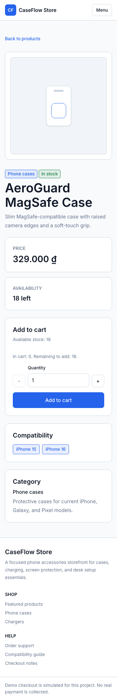

# CaseFlow Store

CaseFlow Store is a production-deployed phone accessories storefront built as a
Next.js modular monolith. It covers catalog discovery, a local cart, guest
checkout, Supabase-backed order persistence, and a protected admin workflow.

[Open the production storefront](https://caseflow-store.vercel.app)

> Checkout is simulated for this portfolio project. The application does not
> collect card details or process real payments.

## Screenshots

<table>
  <tr>
    <th>Storefront desktop</th>
    <th>Storefront mobile</th>
  </tr>
  <tr>
    <td width="72%"></td>
    <td width="28%"></td>
  </tr>
  <tr>
    <th>Product detail desktop</th>
    <th>Product detail mobile</th>
  </tr>
  <tr>
    <td></td>
    <td></td>
  </tr>
</table>

## Product scope

- Browse 16 seeded products across 5 accessory categories.
- Search, sort, filter by category, and check phone compatibility.
- Manage a persistent local cart with stock-aware quantity boundaries.
- Complete a validated guest checkout and receive an order confirmation.
- Sign in as an admin to review orders and update fulfillment status.
- Use explicit loading, empty, error, and success states across core flows.
- Navigate responsive layouts and visible keyboard focus states from 375px to
  1440px viewports.

## Technical highlights

- Next.js App Router keeps UI and Route Handlers in one deployable application.
- Supabase PostgreSQL stores categories, products, profiles, orders, and order
  items; Supabase Auth supplies admin sessions.
- Row Level Security denies public order access while allowing public catalog
  reads. Admin authorization is checked server-side on every protected request.
- The server reloads product records and recalculates line totals and subtotal;
  price, stock, role, and order status are never trusted from the browser.
- Order and order-item inserts run through one PostgreSQL function.
- Zod validates mutating request bodies and API errors use stable response codes.
- Playwright covers storefront, checkout, quantity limits, API errors, access
  roles, admin updates, UI states, and keyboard focus.

## Verified release

| Gate | Result |
|---|---|
| ESLint | Passed |
| TypeScript / production build | Passed, 16 routes generated |
| Local release suite | 20 passed, 0 failed/flaky/skipped |
| Production release suite | 20 passed, 0 failed/flaky/skipped |
| Production deployment | Vercel `Ready` |
| QA cleanup | 0 test orders, 0 temporary users |

Release evidence is recorded in
[`caseflow-store/docs/release-candidate.md`](caseflow-store/docs/release-candidate.md)
and the project execution log under `.agent/`.

## Stack

- Next.js 16, React 19, TypeScript 5
- Tailwind CSS 4
- Supabase PostgreSQL, Auth, SSR client, and RLS
- Zod 4
- Playwright 1.61
- Vercel

## Repository structure

```text
.
├── caseflow-store/           # Next.js application package
│   ├── src/app/              # Pages and Route Handlers
│   ├── src/features/         # Storefront, cart, checkout, and admin UI
│   ├── src/lib/              # Domain, repository, auth, and Supabase code
│   ├── supabase/             # Schema, RLS policies, RPC, and seed data
│   ├── tests/e2e/            # Playwright release suite
│   └── docs/                 # Architecture, ADRs, and release evidence
├── docs/                     # Mirrored project-level documentation
└── .agent/                   # Roadmap, context, and verified task results
```

## Local setup

Prerequisites: Node.js 20 or newer, npm, and a Supabase project.

```bash
cd caseflow-store
npm install
cp .env.example .env.local
```

1. Run `supabase/schema.sql` in the Supabase SQL editor.
2. Run `supabase/seed.sql` to load the catalog.
3. Fill the three required runtime variables in `.env.local`.
4. Create a dedicated Supabase Auth admin user and assign the matching
   `profiles.role` value to `admin` when testing the admin workspace.
5. Start the application:

```bash
npm run dev
```

Open [http://localhost:3000](http://localhost:3000).

## Environment variables

| Variable | Runtime | Purpose |
|---|---|---|
| `NEXT_PUBLIC_SUPABASE_URL` | Browser and server | Supabase project URL |
| `NEXT_PUBLIC_SUPABASE_ANON_KEY` | Browser and server | Public RLS-scoped key |
| `SUPABASE_SERVICE_ROLE_KEY` | Server only | Trusted order/admin operations |
| `CASEFLOW_ADMIN_EMAIL` | Playwright only | Admin release-test identity |
| `CASEFLOW_ADMIN_PASSWORD` | Playwright only | Admin release-test password |

Never expose `SUPABASE_SERVICE_ROLE_KEY` through a `NEXT_PUBLIC_*` variable or a
Client Component. Playwright credentials are not deployed to Vercel.

## Commands

```bash
npm run dev       # development server
npm run lint      # ESLint
npm run build     # production build and TypeScript validation
npm run start     # serve the production build
npm run test:e2e  # Playwright suite; requires all test environment variables
```

To run Playwright against an existing deployment:

```bash
PLAYWRIGHT_BASE_URL=https://caseflow-store.vercel.app npm run test:e2e
```

## Design decisions

The decisions behind the modular monolith, Supabase, mock-first delivery, local
cart, and simulated checkout are documented in
[`caseflow-store/docs/adr/`](caseflow-store/docs/adr/). Release boundaries and
accepted risks are listed in
[`caseflow-store/docs/known-limitations.md`](caseflow-store/docs/known-limitations.md).
Evidence-backed portfolio bullets are available in
[`caseflow-store/docs/cv-bullets.md`](caseflow-store/docs/cv-bullets.md).
