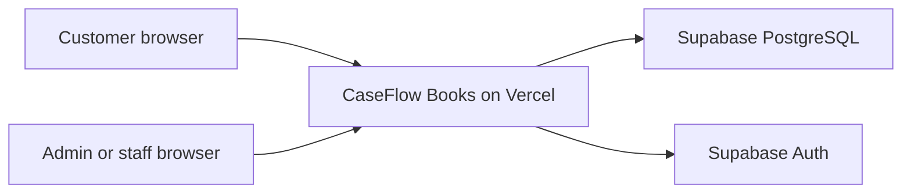
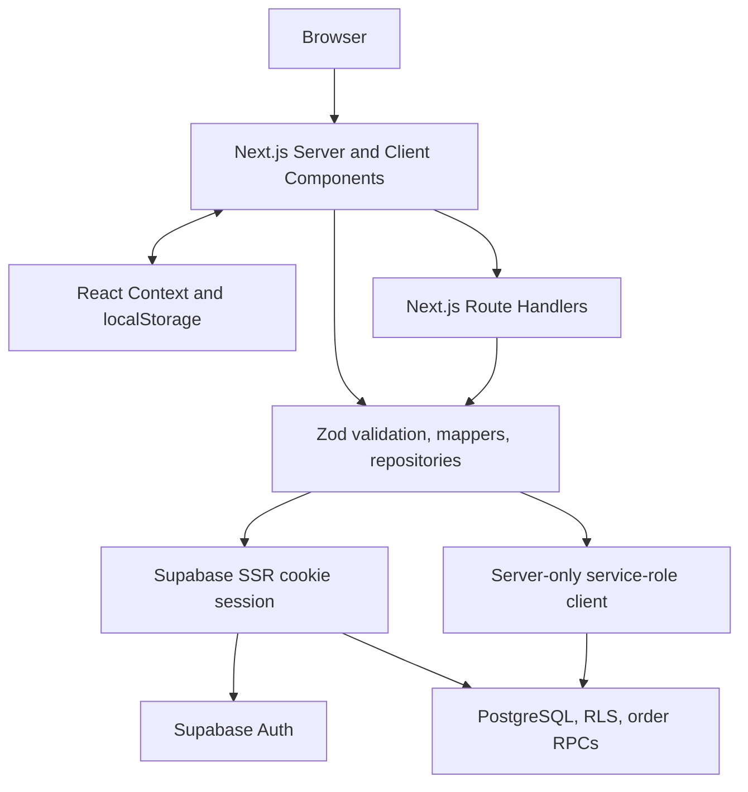

# CaseFlow Books Architecture

## Status

This document describes the deployed CaseFlow Books architecture after the Day
21-40 upgrade, the realistic catalog/content merchandising release, the
`v1.3.0` visual merchandising polish, the `v1.3.1` compact-card layout hotfix,
the `v1.4.0` real-commerce visual merchandising release, the `v1.4.1`
stable closeout patch, the `v1.4.2` agent-inspired security QA hardening
patch, the `v1.5.0` QR demo payment release, the `v1.6.0` retail catalog
scale release, the `v1.7.0` UI humanization release, and the `v1.8.0`
modern editorial bookstore release, the `v1.9.0` real-cover commerce polish,
the `v1.10.0` account-bound signup voucher release, the `v1.11.0`
account password-change release, the `v1.11.1` security dependency patch, the
`v1.11.2` neutral light UI and compact pagination patch, the `v1.11.3`
expert UI/accessibility polish patch, and the `v1.12.0` layered architecture
hardening release, followed by the `v1.12.1` atomic order reliability patch.
The system is
intentionally a Next.js modular monolith: it demonstrates a realistic
specialist e-commerce workflow without claiming marketplace scale, real payment
settlement, or enterprise operations.

## System context



Vercel runs one Next.js application. Supabase is the only external data and
identity service. There is no separate API deployment, payment provider,
shipping-carrier integration, SMS provider, or external AI assistant service.

## Runtime containers



Production pages and Route Handlers use Supabase repositories. Earlier mock
repositories remain as development history and test fixtures, not the selected
production runtime path.

## Application boundaries

| Boundary | Responsibility |
|---|---|
| `src/app` | Pages, layouts, metadata, robots/sitemap, and same-origin Route Handlers |
| `src/features/books` | Storefront discovery, catalog, cards, filters, detail, and related books |
| `src/features/cart` | Browser-local cart drawer and cart summary |
| `src/features/checkout` | Account-gated checkout, totals display, payment-method choice, success state |
| `src/features/customer` | Account, profile readiness, order history, and public tracking UI |
| `src/features/admin` | Dashboard, orders, catalog, inventory, promotions, customers, settings, exports |
| `src/features/assistant` | Rule-based bookstore assistant and guided result links |
| `src/components/ui` | Shared accessible UI primitives |
| `src/lib/use-cases` | Application workflows for high-risk mutating actions such as order creation |
| `src/lib/validation` | Zod schemas for public, customer, checkout, and admin inputs |
| `src/lib/api` | Stable API response envelope, error codes, and controller result mapping |
| `src/lib/repositories` | Supabase persistence, trusted calculations, and operational queries |
| `src/lib/auth` | Customer/admin/staff session and role checks |
| `src/lib/checkout` | Server-owned shipping, VAT, payment fee, promotion, and FX estimate rules |
| `src/lib/payments` | Server-owned QR payment sessions, demo providers, webhook verification, and VietQR payload generation |
| `src/lib/seo` | Canonical URL, Open Graph, robots, sitemap, and JSON-LD helpers |
| `supabase/schema.sql` and `supabase/migrations` | Base schema, v1.1 book schema, RLS, grants, constraints, and RPCs |
| `tests/e2e` | Release flows and access-control verification |

Database rows use `snake_case`. Repository mappers convert them to
`camelCase` domain objects before UI, use-case, or API code consumes them.

High-risk mutating APIs follow the ADR-0014 layering rule:

```text
Route Handler / Controller
  -> Application Use Case
  -> Domain Policy / Validation
  -> Repository
  -> Supabase/PostgreSQL
```

This is intentionally layered architecture inside a Next.js modular monolith,
not a forced textbook MVC rewrite. Route Handlers parse HTTP input and map
stable API envelopes; use cases coordinate business workflows; repositories own
persistence and row mapping.

## Core request flows

### Catalog read

```text
Browser request
  -> Next.js page or GET Route Handler
  -> Supabase book repository
  -> RLS-scoped active category/work/edition query
  -> row-to-domain mapping and Zod validation
  -> rendered UI or { data, error, meta } API envelope
```

Anonymous catalog reads use public RLS-scoped access. Public catalog results
include active book categories, works, sellable editions, author/publisher
metadata, safe cover references, pagination metadata, and stable error
envelopes.

### Local cart

```text
Browser localStorage cart
  -> editionId + quantity only
  -> cart drawer/detail/cart entry points
  -> POST /api/cart/validate before checkout display
  -> server reloads active edition records and recalculates line totals
```

The cart deliberately does not store trusted price, subtotal, tax, role, or
order status. It remains browser-local rather than cross-device.

### Account-gated checkout

```text
Customer session
  -> browser reuses one checkoutAttemptId across retries
  -> profile readiness check
  -> account welcome voucher read/grant for eligible customer
  -> checkout cart validation
  -> payment/shipping method selection
  -> POST /api/orders thin controller validates the request DTO
  -> createBookOrderUseCase recovers an existing customer/attempt order
  -> use case coordinates auth, promotion, voucher eligibility, totals, and persistence
  -> server-owned subtotal, account-bound promotion, VAT, shipping, payment fee, total
  -> create_book_order_with_items_v2 RPC
  -> order, items, and optional account voucher commit in one transaction
  -> order snapshot and confirmation state
```

Checkout requires a signed-in customer and enough profile/contact/address data
to submit the order. The server ignores browser-supplied totals and reloads
trusted edition records before creating the order. Existing simulated payment
states represent pending COD, bank transfer, or provider confirmation; no
external payment credential is collected or submitted.

### Customer signup vouchers

```text
New or eligible signed-in customer
  -> server ensures the 3 fixed welcome campaigns exist
  -> service-role repository grants account-bound voucher rows
  -> account and checkout pages render available voucher codes
  -> customer can choose one code for the current order
  -> /api/orders verifies ownership, expiry, and single-code input
  -> voucher is reserved during order creation
  -> voucher is marked used only after the order is created successfully
```

Signup vouchers are intentionally separate from general store promotions. The
browser can display and prefill a code, but it cannot decide ownership,
availability, expiry, discount amount, or final totals. `WELCOME30K`,
`READMORE20K`, and `FREESHIP25K` are granted per customer account and remain
valid for 30 days from activation. Only one promotion code is accepted per
order request; malformed multi-code requests fail validation before totals are
calculated. The database consumes an eligible account voucher in the same
transaction as the order. A failed transaction leaves both unchanged, while a
repeated customer/attempt pair returns the existing order.

### QR demo payment session

```text
Signed-in customer
  -> checkout creates an order with server-owned totals
  -> /checkout/payment creates or resumes a payment by order code
  -> POST /api/payments reloads the order and reads orders.total_vnd
  -> selected provider builds a QR payload
  -> browser renders the QR and polls GET /api/payments/[paymentId]
  -> dev-only simulate endpoint sends a signed mock webhook
  -> webhook service verifies HMAC and idempotently marks payment/order paid
```

`payments` is separate from `orders`: order fulfillment state and payment state
do not share one status field. QR demo payment is available only outside
production when `PAYMENT_MODE=demo`; the simulate-success endpoint also requires
`ENABLE_MOCK_PAYMENT=true` and `NODE_ENV !== "production"`. In production, the
same route handlers are present in the Next.js app but return a denied status
instead of creating or completing demo payments.

The QR provider boundary supports `MOCK_GATEWAY` and `DEMO_VIETQR`. VietQR
payloads are generated server-side from configured demo bank data, the
merchant/store name, the order code, and the trusted stored VND total. The
frontend does not receive webhook secrets and cannot decide the payable amount.

### Customer order history, cancellation, and public tracking

```text
Signed-in customer
  -> own order API/page
  -> server session check
  -> own-order response only
  -> eligible early-state cancellation only after ownership/status checks

Public lookup
  -> order code plus matching email or phone
  -> tracking-safe response
```

Signed-in customers can cancel only their own eligible pending/confirmed
orders before payment or fulfillment moves beyond the accepted cancellation
window. The cancellation route repeats customer session and order-ownership
checks on the server, then writes order, payment, and shipping states to
cancelled as one controlled repository update.

Public tracking intentionally returns the same not-found response for missing
orders and wrong-contact lookups to reduce order enumeration risk. It does not
expose raw address, raw phone, or customer email.

### Admin and staff operations

```text
Supabase Auth session
  -> profile role lookup
  -> admin/staff permission check
  -> protected admin page or Route Handler
  -> server-only repository
  -> operational mutation or read
```

UI navigation is not an authorization boundary. Protected admin Route Handlers
repeat role and permission checks server-side. Staff can access operational
screens allowed by policy, including rejecting or cancelling risky orders
through the same server-side transition checks used by admin users. High-risk
settings and promotion changes remain admin-only where implemented.

## Data model

The active `v1.1` schema adds a bookstore domain while preserving the original
project history:

- `book_categories`, `book_works`, `book_editions`, author/category join
  tables, translators, publishers, and cover assets form the public catalog.
- `profiles` stores customer/admin/staff role and checkout-readiness profile
  fields.
- `orders` stores customer/order status, payment status, shipping status,
  shipping/tax/payment-fee/promotion snapshots, and guarded tracking fields.
- `order_items` stores book edition/work snapshots so historical orders do not
  change when catalog records change.
- `payments` stores QR payment sessions with provider, amount, currency,
  status, QR payload, payment reference, expiry, paid timestamp, and order
  relation.
- `book_promotions` stores simple fixed-VND or percentage promotion codes.
- `customer_promotion_vouchers` stores account-bound signup voucher grants,
  expiry, short-lived checkout reservation tokens, used timestamps, and the
  redeemed order relation.
- `book_inventory_adjustments` records operational stock adjustments.
- Monetary values are stored as integer VND amounts. USD display is an
  estimate, not a source-of-truth value.

`V12-T11` applied the accepted v1.2 additive catalog migration to Supabase
production. `book_editions` now also carries edition-pair, reason-to-read,
display-fact, omitted-fact, source-edition-key, and source-review-status fields.
The database also includes catalog provenance records, content-quality checks,
catalog compatibility records, merchandising shelves, and merchandising shelf
items. The data-freeze import contains 50 active works, 100 active editions,
100 v1.2 cover assets, 602 provenance records, 2,000 content-quality checks, 9
merchandising shelves, and 20 manual shelf items. `V12-T12` through `V12-T15`
wire this data through homepage merchandising, catalog discovery, product
detail/edition comparison, and admin content-quality/merchandising operations.
`V12-T16` integrates the same accepted catalog across search, the rule-based
assistant, SEO, cart/order snapshots, exports, and current documentation.

The cart is absent from the database. It stores only `editionId` and `quantity`
in localStorage and is revalidated before checkout.

## Security model

| Actor | Catalog | Customer order history/cancellation | Public tracking | Admin/staff APIs |
|---|---|---|---|---|
| Anonymous | Read active rows | Denied | Guarded lookup only | 401 |
| Authenticated customer | Read catalog and own profile | Own orders and eligible own-order cancellation only | Guarded lookup only | 403 |
| Staff | Read catalog and allowed operations | Operational reads as allowed | Guarded lookup only | Permission-scoped |
| Admin | Read catalog and all operations in scope | Operational reads | Guarded lookup only | Allowed after role check |
| Server service role | Trusted backend operations | Trusted backend operations | Trusted backend operations | Internal only |

Additional controls:

- RLS is enabled on catalog, profile, order, promotion, and inventory tables.
- Public/admin mutating bodies are validated with Zod.
- Signed-in users can change only their own Supabase Auth password. The
  password-change route reads the current auth user on the server, verifies the
  current password through Supabase re-authentication, and then calls Supabase
  Auth to update the password. Admin/staff password resets for other accounts
  are intentionally outside the application UI.
- The service-role key is read only by server modules and never exposed through
  `NEXT_PUBLIC_*`.
- Server code recalculates price, promotion, VAT, shipping, payment fee, and
  total values.
- Customer signup voucher rows are not exposed through public RLS. Server-side
  repositories verify customer ownership, expiry, reservation state, and one
  code per order before applying any discount.
- Runtime responses include security headers for CSP, HSTS, frame blocking,
  content-type sniffing protection, referrer policy, permissions policy, and
  cross-origin isolation controls where compatible with the current Next.js
  runtime.
- API, account, admin, checkout, and order tracking surfaces send no-store
  cache policy headers.
- The application does not collect card fields, real e-wallet credentials, or
  bank credentials.
- QR demo webhook completion requires an HMAC signature and idempotent server
  update. Mock payment simulation is locked outside development/sandbox and is
  never a production settlement path.
- Phone/email profile fields are not backed by real SMS/OTP or email-provider
  verification in `v1.1`.
- Production does not contain Playwright admin/customer credentials.

## Content and asset model

CaseFlow Books uses factual classic/public-domain-style book metadata where
practical, self-written summaries, and 500 local project-created SVG cover
illustrations across the active v1.6 catalog. The generic placeholder remains
only as a fallback/admin quality state. The project does not hotlink commercial
book covers or copy publisher blurbs, reviews, or protected excerpts. The
current policy is documented in [`domain.md`](domain.md),
[`v1.2-cover-portfolio.md`](v1.2-cover-portfolio.md), and
[`v1.2-provenance-content-quality-contracts.md`](v1.2-provenance-content-quality-contracts.md).

## v1.2 provenance contract boundary

`V12-T04` defined catalog-specific provenance, edition-consistency,
content-quality, and public-safe serialization contracts. `V12-T11` applied the
additive storage needed for those contracts after the catalog, cover,
editorial, merchandising, and rollback plans were frozen. The legacy
`SourceNote` remains stable for existing estimate and source-note uses.

Public serialization uses an allowlist and never exposes internal reviewer
notes, rights-analysis notes, or source-edition matching keys. See
[`v1.2-provenance-content-quality-contracts.md`](v1.2-provenance-content-quality-contracts.md).

## Deployment and verification

- Production alias: `https://caseflow-store.vercel.app`.
- Current production deployment ID: `dpl_9FRaok8hK8sddmbGBL3RvkMM9fLs`
  (`v1.8.0`).
- Supabase hosts PostgreSQL and Auth.
- Production runtime variables include the public Supabase URL, public anon key,
  and server-only service-role key. Canonical metadata defaults to the
  production alias when `NEXT_PUBLIC_SITE_URL` is absent.
- The `v1.2` local release gate passed TypeScript, ESLint, production build,
  aggregate catalog/content/asset/runtime checks, cleanup, and 20 Playwright
  tests.
- The `v1.2` production smoke gate passed public page/API checks, 100-edition
  catalog quality, 100 v1.2 cover responses, protected customer/admin boundary
  checks, language mode, cart/checkout boundary, assistant, robots/sitemap, and
  20 production Playwright tests.
- The `v1.3.0` production release kept the same architecture and added visual
  merchandising polish. `QA-FINAL-T01` passed production smoke, full local
  production-style Playwright `20/20`, final tester audit, accessibility/
  mobile/performance checks, cleanup, secret-like scan, stale-claim scan,
  TypeScript, lint, and production build.
- The `v1.4.0` production release kept the same architecture and added
  customer-facing commercial copy cleanup, structurally varied merchandising
  layouts, trust/policy pages, checkout/customer surface polish, and admin
  operations visual hierarchy. Production release smoke passed with 100 active
  editions, 100 cover responses, 50 English editions, 50 Vietnamese editions,
  public/customer/admin boundaries, language mode, assistant, and representative
  detail pages.
- The `v1.4.1` patch kept the same architecture and verified the stable
  closeout fixes: compact-card layout, customer order history/cancellation,
  staff/admin rejection-cancellation operations, final QA smoke, production
  release smoke, cleanup, secret scan, TypeScript, lint, and production build.
- The `v1.4.2` patch kept the same architecture and added security headers,
  protected-surface no-store policy, an automated security posture verifier,
  agent-inspired QA reporting, production final QA smoke, cleanup, secret scan,
  TypeScript, lint, and production build.
- The `v1.5.0` release adds the QR demo payment provider boundary,
  the `payments` table, idempotent payment/order RPC, mock webhook HMAC
  verification, VietQR demo payload generation, production mock-payment lock,
  QR flow verifier, production-safety verifier, UI regression verifier, secret
  scan artifact, full local and production Playwright `20/20`, TypeScript,
  lint, production build, production release smoke, security posture, and final
  QA smoke.
- The `v1.6.0` release keeps the same architecture and scales the active
  catalog to 500 sellable editions with 250 English and 250 Vietnamese
  products, 400 generated v1.6 retail-edition covers, refreshed VND price
  bands, customer-facing homepage hero copy, catalog count layout polish, and
  updated QA baselines for the 500-edition catalog.
- The `v1.7.0` release keeps the same architecture and adds UI humanization:
  audit-backed style guidance, a bookstore-specific reading-table/spine-rail
  motif, reduced generic card/pill repetition, public header cleanup, product
  detail metadata wrapping, reading-path label overflow fixes, and admin
  dashboard/order-operation normalization so cancelled orders do not appear as
  collectable pending payments.
- The `v1.8.0` release keeps the same architecture and adds search-first
  desktop navigation, live category discovery, mobile search/category access,
  cover provenance manifest checks, honest fallback-cover labeling, CSS-first
  motion tokens, reduced-motion-aware product-card feedback, back-to-top
  support for long pages, and production V18/release/security/QR/final QA
  verification.
- Dependency audit status is recorded in
  [`v1.2-release-audit.md`](v1.2-release-audit.md).

## Decision record

The accepted decisions and their implementation outcomes are indexed in
[`adr/README.md`](adr/README.md).

## Evolution path

The next architecture changes should respond to real product requirements.
Likely candidates are real payment-provider integration, SMS/email
verification, stock reservation/decrement inside checkout, shipping-carrier
quotes, rate limiting, audit logs, managed product media, and cross-device
carts. Each major change requires a new ADR before implementation.
