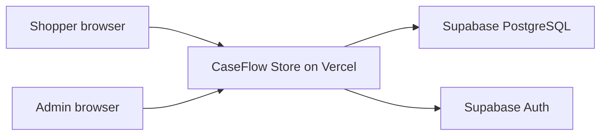
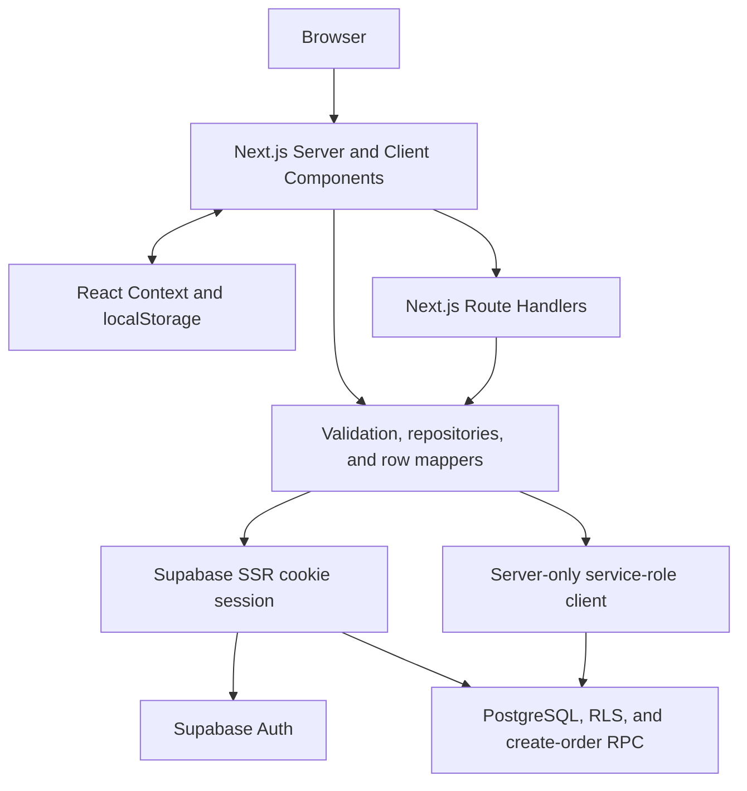

# CaseFlow Store Architecture

## Status

This document describes the production architecture released after the 20-day
implementation cycle. CaseFlow Store is intentionally a modular monolith: it
demonstrates a complete commerce workflow without claiming marketplace-scale
infrastructure.

## System context



Vercel runs one Next.js application. Supabase is the only external data and
identity service. There is no separate API deployment or payment provider.

## Runtime containers



Production pages and Route Handlers use the Supabase repositories. Mock
repositories remain as development history and fixtures, but are not selected by
the production runtime.

## Application boundaries

| Boundary | Responsibility |
|---|---|
| `src/app` | Pages, layouts, and same-origin Route Handlers |
| `src/features` | Storefront, cart, checkout, and admin presentation/workflows |
| `src/components/ui` | Shared accessible UI primitives |
| `src/lib/domain` and `src/lib/validation` | Domain contracts and Zod input validation |
| `src/lib/repositories` | Catalog/order persistence and server-owned calculations |
| `src/lib/supabase` | Browser, SSR, proxy, and server-only Supabase clients |
| `src/lib/auth` | Session and admin-role authorization |
| `supabase/schema.sql` | Tables, constraints, indexes, RLS, grants, and order RPC |
| `tests/e2e` | Release flows and access-control verification |

Database rows use `snake_case`. Repository mappers convert them to
`camelCase` domain objects before UI or API code consumes them.

## Core request flows

### Catalog read

```text
Browser request
  -> Next.js page or GET Route Handler
  -> Supabase catalog repository
  -> RLS-scoped active category/product query
  -> row-to-domain mapping
  -> rendered UI or API envelope
```

Anonymous catalog reads use the public key and RLS. The service-role key is not
needed for storefront discovery.

### Cart validation and checkout

```text
Browser localStorage cart: productId + quantity
  -> POST /api/cart/validate or POST /api/orders
  -> Zod validates request shape
  -> server reloads current active products
  -> server checks stock and recalculates line totals/subtotal
  -> server-only client invokes create_order_with_items
  -> PostgreSQL inserts order and item snapshots atomically
  -> order code and server-calculated total return to the browser
```

The browser never supplies an authoritative price, subtotal, product name,
stock value, role, or order status. Product name and unit price are copied into
order-item snapshots so historical orders do not change with the catalog.

The order RPC atomically inserts the order and its items. It validates current
stock but does not reserve or decrement stock; that is an explicit MVP
limitation, not an implied inventory system.

### Admin authentication and authorization

```text
Credentials
  -> POST /api/admin/session
  -> Supabase Auth session cookie
  -> full navigation to /admin/orders
  -> server page checks session and profiles.role
  -> protected Route Handler repeats the same authorization
  -> server-only repository reads or updates orders
```

The Next.js proxy refreshes Supabase cookies. UI visibility is not an
authorization boundary: both server-rendered admin pages and every admin Route
Handler reject missing sessions and non-admin roles.

## Data model

- `categories` and `products` form the public active catalog.
- `profiles` extends Supabase Auth identities with `customer` or `admin` roles.
- `orders` stores guest contact/shipping data, status, currency, subtotal, and a
  unique public order code.
- `order_items` stores product references plus product-name and unit-price
  snapshots.
- Monetary values are integer VND amounts.
- Foreign keys, checks, unique constraints, timestamps, and status constraints
  are enforced in PostgreSQL.

The cart is deliberately absent from the database. It stores only
`productId` and `quantity` in localStorage and is revalidated before checkout.

## Security model

| Actor | Catalog | Direct order tables | Admin APIs |
|---|---|---|---|
| Anonymous | Read active rows | Denied | 401 |
| Authenticated customer | Read catalog and own profile | Denied | 403 |
| Authenticated admin | Read catalog and own profile | Denied directly | Allowed after server role check |
| Server service role | Trusted backend operations | Allowed | Internal only |

Additional controls:

- RLS is enabled on all five public tables.
- Public and authenticated grants are explicit; order-table access is denied.
- `SUPABASE_SERVICE_ROLE_KEY` is read only by server modules and is never
  exposed through `NEXT_PUBLIC_*`.
- Mutating bodies are validated on the server.
- The application does not collect payment-card fields.
- Production does not contain Playwright admin credentials.

## Deployment and verification

- Vercel hosts the Next.js application at
  `https://caseflow-store.vercel.app`.
- Supabase hosts PostgreSQL and Auth.
- Production has three runtime variables: the public project URL, public anon
  key, and server-only service-role key.
- The release gate requires lint, TypeScript/production build, Playwright, and
  cleanup checks.
- The accepted production suite passed 20/20 with no failed, flaky, or skipped
  tests.

## Decision record

The accepted decisions and their implementation outcomes are indexed in
[the ADR index](adr/README.md).

## Evolution path

The next architecture changes should respond to actual product requirements.
Likely candidates are stock reservation/decrement, payment-provider integration,
email notifications, rate limiting/abuse controls, managed product media, and
cross-device carts. Each major change requires a new ADR before implementation.
