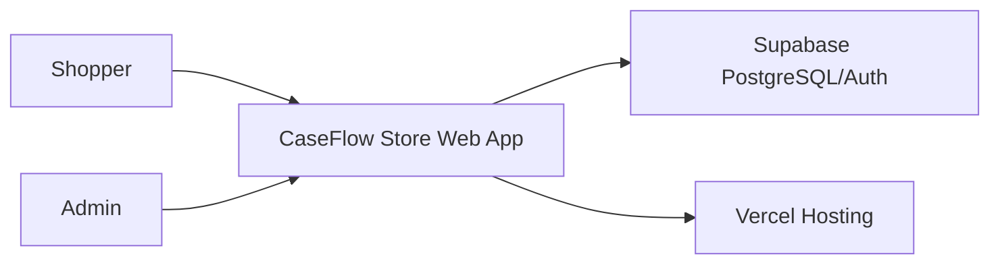
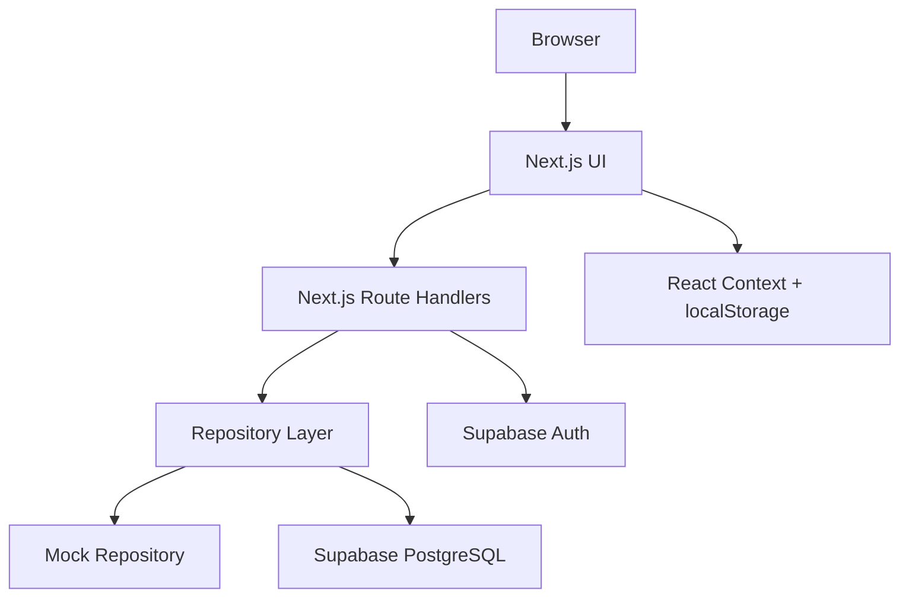

# CaseFlow Store Architecture

## Context

CaseFlow Store is a small e-commerce MVP for portfolio use. The architecture must prove full-stack capability without pretending to be a large-scale commerce platform.

The main risk is not a lack of advanced architecture. The main risk is overengineering before the core store, checkout, admin, tests, and deployment work.

## Quality Attributes

Priority order:

1. Development speed within 20 days
2. Correct order and price handling
3. Maintainability for one developer
4. Responsive mobile usability
5. Low operational cost
6. Clear portfolio explanation
7. Visual polish

## System Overview



## Container View



## Request Flow

### Product Listing

```text
Browser
  -> Next.js page
  -> product repository
  -> mock data or Supabase
  -> domain Product[]
  -> UI
```

### Checkout

```text
Browser cart productId/quantity
  -> POST /api/orders
  -> Zod validation
  -> server reads products from database
  -> server recalculates price and subtotal
  -> transaction/RPC creates order and order_items
  -> order code returned
```

## Important Boundaries

- UI should consume domain objects, not raw database rows.
- Database rows can be snake_case; domain objects should be camelCase.
- Cart localStorage is not trusted.
- Admin role is verified server-side.
- Payment is simulated; no card data is collected.

## Data Consistency

Required:

- Product price stored as integer VND.
- Server recalculates totals.
- Order items store product name and unit price snapshots.
- Order status is constrained.
- Product and order slugs/codes are unique.

Open decision for implementation:

- If stock decrement is included, order creation should be atomic through SQL transaction or Supabase RPC.
- If true stock decrement is too risky for the 20-day MVP, document the limitation rather than implementing partial stock logic.

## Security Model

Public users can:

- Read active products.
- Submit guest checkout data.

Admins can:

- Read all orders.
- Update order status.

Rules:

- RLS deny by default.
- Anonymous users cannot read all orders.
- Normal users cannot access admin APIs.
- Admin check must happen in Route Handlers and server-rendered admin pages.

## Deployment Model

- Vercel hosts the Next.js app.
- Supabase hosts PostgreSQL and Auth.
- Smoke deploy should happen early.
- Day 19 must not be the first deployment attempt.

## Why Not Microservices

Microservices would add infrastructure, deployment, auth, API gateway, data consistency, and observability complexity that does not fit a 20-day portfolio MVP.

The project can still discuss an evolution path later, but implementation should remain modular monolith.

## Evolution Path After MVP

Only after the MVP is complete:

- Add email notifications.
- Add better order cleanup for demo data.
- Add product image management.
- Add stock reservation.
- Add real payment provider.
- Add search indexing if product count grows.
- Add rate limiting and stronger abuse controls.
