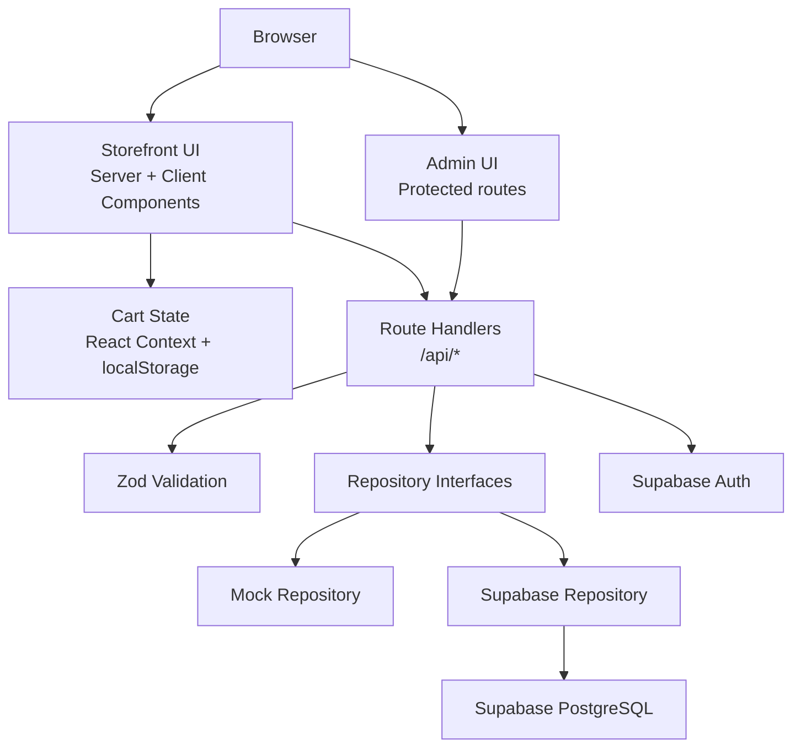

# Container Diagram

```mermaid
flowchart TB
  Browser["Browser"]
  StoreUI["Storefront UI\nServer + Client Components"]
  AdminUI["Admin UI\nProtected routes"]
  CartState["Cart State\nReact Context + localStorage"]
  API["Route Handlers\n/api/*"]
  Validation["Zod Validation"]
  Repositories["Repository Interfaces"]
  MockRepo["Mock Repository"]
  SupabaseRepo["Supabase Repository"]
  Database["Supabase PostgreSQL"]
  Auth["Supabase Auth"]

  Browser --> StoreUI
  Browser --> AdminUI
  StoreUI --> CartState
  StoreUI --> API
  AdminUI --> API
  API --> Validation
  API --> Repositories
  Repositories --> MockRepo
  Repositories --> SupabaseRepo
  SupabaseRepo --> Database
  API --> Auth
```
