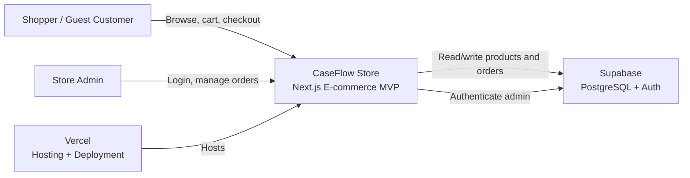

# System Context Diagram

```mermaid
flowchart LR
  Shopper["Shopper / Guest Customer"]
  Admin["Store Admin"]
  App["CaseFlow Store\nNext.js E-commerce MVP"]
  Supabase["Supabase\nPostgreSQL + Auth"]
  Vercel["Vercel\nHosting + Deployment"]

  Shopper -->|"Browse, cart, checkout"| App
  Admin -->|"Login, manage orders"| App
  App -->|"Read/write products and orders"| Supabase
  App -->|"Authenticate admin"| Supabase
  Vercel -->|"Hosts"| App
```
