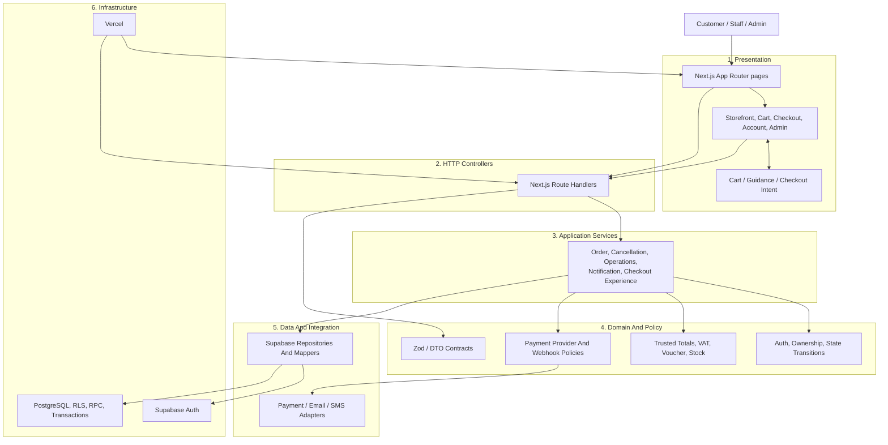
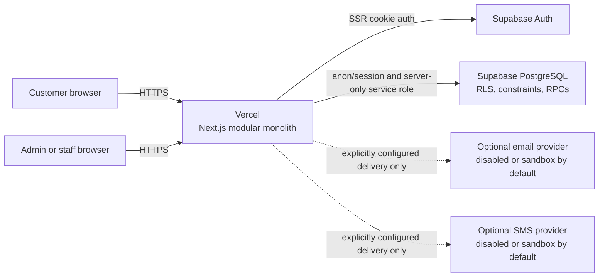
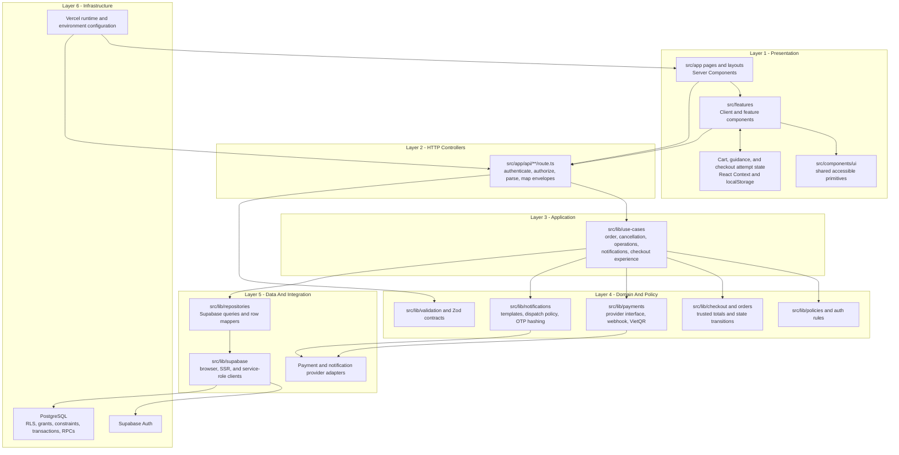
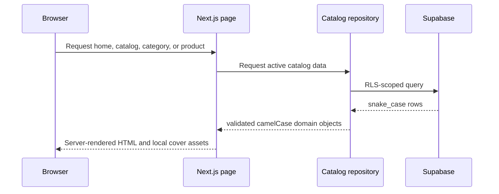
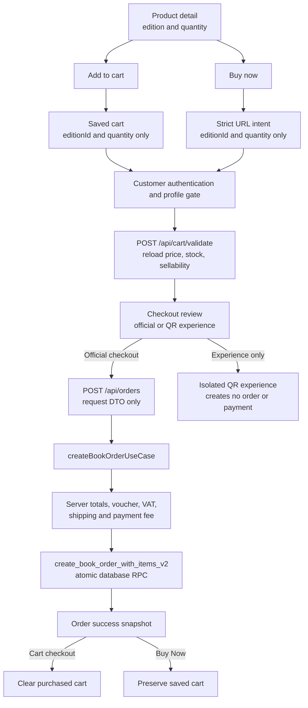
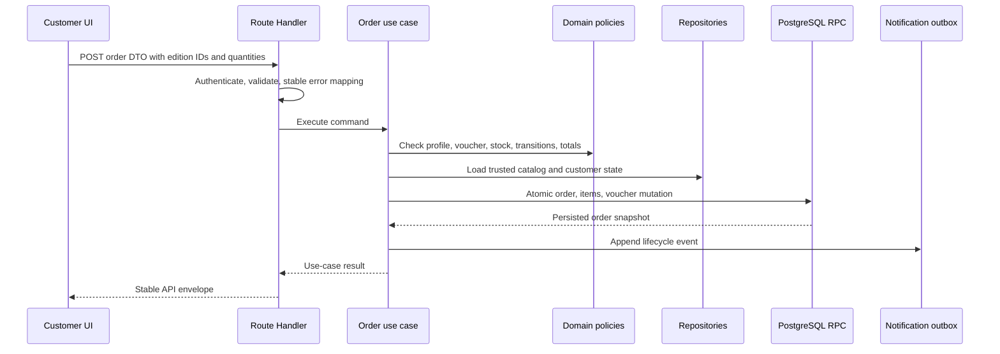
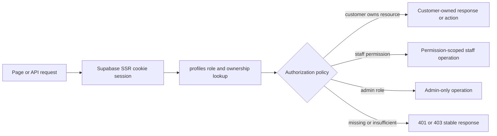
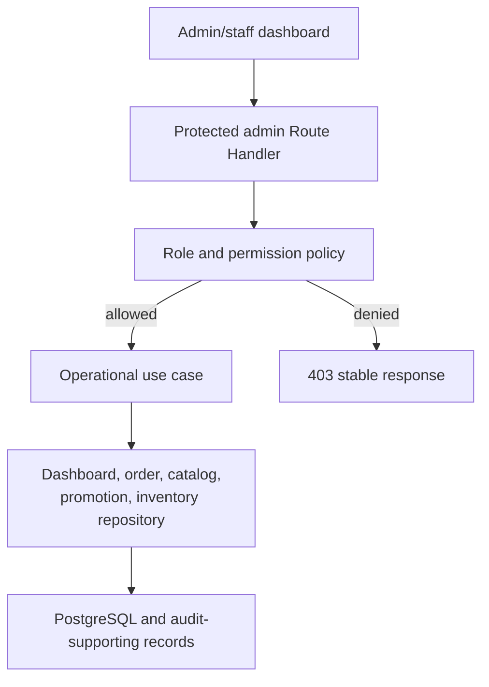
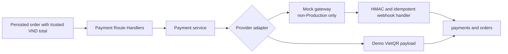
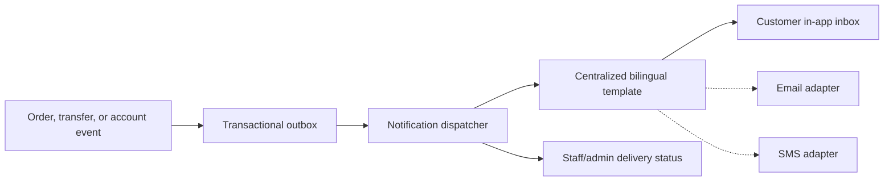

# CaseFlow Books Layer Architecture

## Scope

This document redraws the complete `v1.17.0` application architecture from the
deployed system boundary down to the database. It describes the source that
exists in the repository. It does not claim that CaseFlow Books is a
microservice system, a textbook MVC application, or a live payment/logistics
platform.

CaseFlow Books is a layered Next.js modular monolith:

- page and feature components own presentation;
- Route Handlers act as HTTP controllers;
- use cases coordinate high-risk workflows;
- policies, Zod schemas, and calculation modules own business rules;
- repositories own persistence and row mapping;
- Supabase provides authentication and PostgreSQL;
- Vercel hosts the application runtime.

## Report-ready Summary Diagram

Use this compact diagram when a report needs one full-system architecture
figure before the detailed module and sequence diagrams.

## 1. System And Deployment Context

The browser never connects to a payment gateway, notification secret, or
service-role credential. There is no real bank settlement, card processor,
shipping carrier, warehouse feed, or map tracking integration in this
showroom release.

## 2. Application Layers

Allowed dependency direction is downward. UI code may call same-origin
controllers, but it must not import the service-role client or write trusted
commerce state. Repositories may map database rows, but they do not render UI.

## 3. Feature Modules

| Module | Presentation responsibility | Server/application responsibility |
|---|---|---|
| Books | Home, catalog, filters, details, edition comparison, merchandising | Catalog reads, active/sellable filtering, content quality |
| Cart | Local cart drawer, quantity and removal controls | Server revalidation through `/api/cart/validate` |
| Checkout | Profile gate, official/experience selection, review, success | Trusted totals, voucher validation, atomic order creation |
| Customer | Account, profile, notifications, order history, cancellation | Ownership checks, password assurance, order transitions |
| Admin | Dashboard, catalog, inventory, orders, promotions, customers | Role/permission checks and operational use cases |
| Payments | QR status and payment presentation | Provider interface, HMAC webhook, idempotency, Production lock |
| Notifications | Customer inbox and operator delivery status | Outbox, templates, provider modes, OTP hash/expiry/attempt policy |
| Assistant | Rule-based guided search UI | Catalog-backed matching and bounded bookstore responses |
| Guidance | Contextual customer tours | Browser-local completion only; no commerce authority |

## 4. Storefront Read Flow

Catalog content is read from active/sellable records. Price, stock, edition
identity, and publication metadata come from repository-backed domain objects,
not from decorative client fixtures.

## 5. Cart And Buy Now Checkout

Both purchase entry points converge at the same trusted server boundaries, but
their browser state remains intentionally separate.

The URL and localStorage are untrusted transport. They never carry an
authoritative price, discount, VAT, fee, order state, payment state, or role.
Malformed Buy Now intent fails closed instead of falling back to the cart.

## 6. Order, Payment, And Notification Write Flow

Persisted QR payment sessions are a separate domain from the isolated checkout
experience. Payment status and fulfillment status are separate fields.
Production cannot call the development simulate-success endpoint.

## 7. Customer Authentication And Authorization

Navigation visibility is only presentation. Every protected Route Handler
repeats authentication, role, ownership, and transition checks on the server.
Customers use single-use email recovery for password changes. Admin/staff
password changes add current-password reauthentication and a server-only
operations control; this is a showroom safeguard, not enterprise MFA.

## 8. Admin And Staff Operations

Staff handles bounded day-to-day operations. Admin retains higher-risk
settings and promotion authority. Rejected/cancelled orders are excluded from
collectable pending-payment metrics by server-owned dashboard normalization.

## 9. Payment Boundaries

The service owns payment state transitions. The frontend can render a returned
QR payload and poll status, but it cannot choose the amount, access the webhook
secret, or mark a payment paid. The separate checkout experience is a
showroom interaction and cannot mutate these tables.

## 10. Notification Boundaries

External delivery is fail-closed unless explicitly configured. Sandbox mode
records inspectable previews without network delivery. OTP values are hashed
and bounded by ownership, expiry, resend, and attempt limits.

## 11. Data Ownership

| Data | Authoritative owner | Browser role |
|---|---|---|
| Catalog price and stock | PostgreSQL through catalog repositories | Display only |
| Cart selection | Browser localStorage | Stores edition ID and quantity |
| Buy Now selection | Strict same-origin URL intent | Transports edition ID and quantity |
| Shipping, VAT, fee, discount, total | Server checkout policy | Displays server result |
| Customer identity and role | Supabase Auth and `profiles` | Holds SSR session cookie |
| Order and order items | PostgreSQL transaction/RPC | Submits request DTO and reads own result |
| Payment status | Payment service and `payments` table | Polls authorized status |
| Notification state | Outbox and notification repositories | Reads own inbox |
| Guidance completion | Browser localStorage | Presentation preference only |

## 12. Boundary Rules

1. Client code never imports service-role modules or provider secrets.
2. Route Handlers remain thin controllers and map stable API envelopes.
3. High-risk mutations go through use cases instead of direct UI-to-repository
   calls.
4. Domain validation and policy run before persistence.
5. Repositories own database queries and snake_case-to-camelCase mapping.
6. Order totals are always recalculated on the server.
7. Authentication, role, ownership, and transition checks are repeated on
   every protected server boundary.
8. Payment and fulfillment states remain separate.
9. Mock settlement stays disabled in Production.
10. New external providers or runtime boundaries require an ADR.

## 13. Why This Is Not A Textbook MVC Rewrite

Next.js App Router combines server rendering and same-origin HTTP endpoints in
one deployable unit. Forcing folders named `models`, `views`, and
`controllers` would not improve the actual dependency direction. The project
uses the useful parts of layered architecture:

- React/Next.js pages and features are the view/presentation layer.
- Route Handlers are controllers.
- Zod/domain types and business policies are the model/domain layer.
- Use cases are the application service layer.
- Repositories and Supabase clients are the data-access layer.
- Request and response schemas are DTO contracts.

This mapping is explicit, testable, and compatible with the framework rather
than imitating an unrelated server architecture.

## 14. Verification

The architecture is verified by:

- `npm run verify:architecture` for forbidden dependency and boundary checks;
- TypeScript for contract integrity;
- API and E2E tests for auth, role, ownership, order, payment, notification,
  cart, and Buy Now behavior;
- build and Production smoke tests for deploy-time and runtime integration;
- secret, no-demo, and Production mock-payment gates.

The authoritative implementation details remain in
[`architecture.md`](architecture.md), the ADR index under
[`adr/README.md`](adr/README.md), and the source paths named above.

## 15. Report Reuse

- Recommended placement: the report chapter `System Design / Overall
  Architecture`, after the technology-stack overview and before module or
  database details.
- Recommended Vietnamese caption: `Hinh: Kien truc phan lop tong the cua he
  thong CaseFlow Books`.
- Recommended English caption: `Figure: CaseFlow Books complete layered
  architecture`.
- Use the compact summary diagram for the main report. Move the detailed
  deployment, commerce, authentication, operations, payment, and notification
  diagrams to their corresponding subsections or appendix.
- Render from this Mermaid source when the report is generated. Do not keep a
  separately edited screenshot as the source of truth.
- If runtime boundaries change after `v1.17.0`, update this document and rerun
  `npm run verify:architecture` before reusing the figure.
