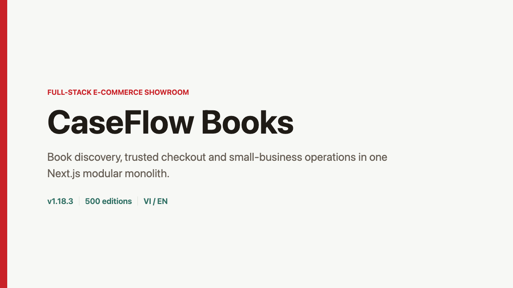
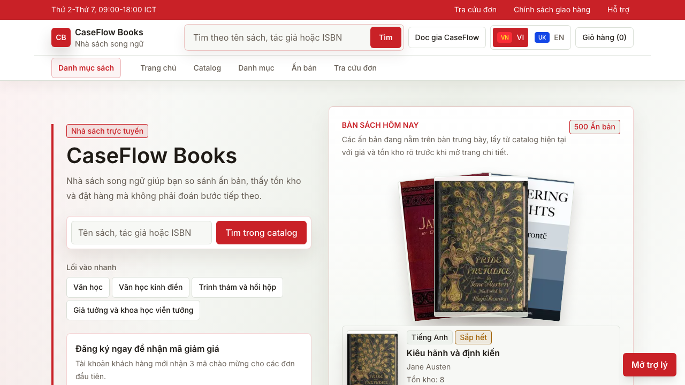
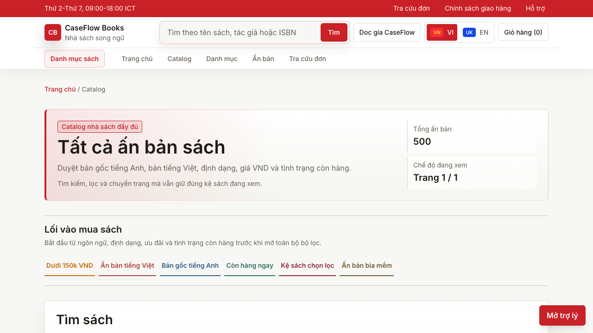
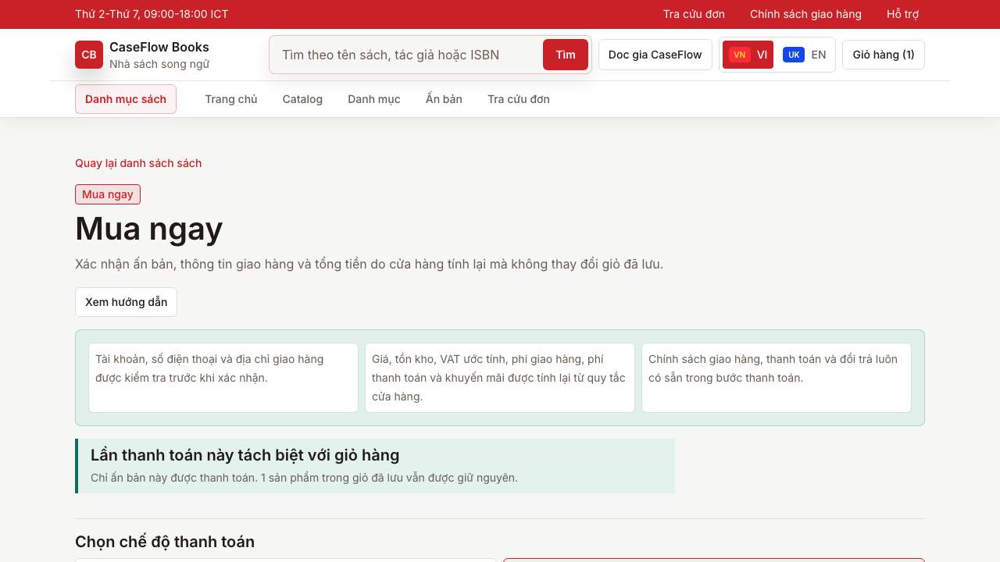
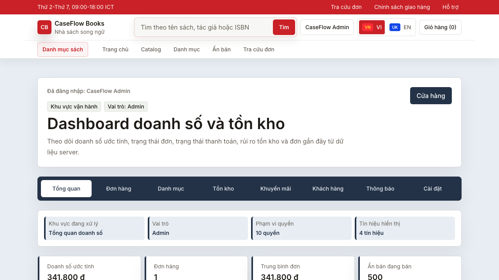
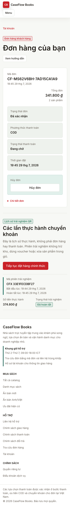
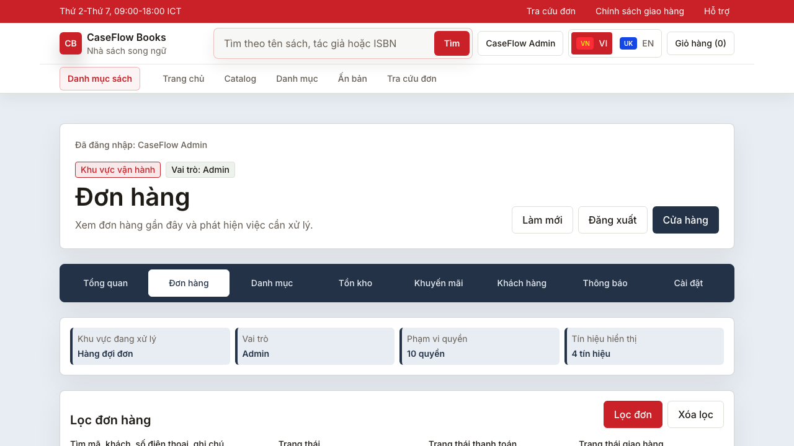

# CaseFlow Books Portfolio Package

CaseFlow Books is a deployed, Vietnam-first bilingual bookstore showroom. This
package presents the product, architecture, operating model, and verified
engineering evidence without claiming real payment settlement, logistics, or
business traction.

- Production: [caseflow-store.vercel.app](https://caseflow-store.vercel.app)
- Source release: [v1.18.4](https://github.com/NVTruong473/caseflow-store/releases/tag/v1.18.4)
- Architecture: [layer-architecture-v1.17.md](../layer-architecture-v1.17.md)
- Case study: [case-study.md](case-study.md)

## Product Demo

[](assets/demo-v1.18.3/caseflow-books-demo-v1.18.3-vi.mp4)

- Video: [MP4, 3:34, Vietnamese](assets/demo-v1.18.3/caseflow-books-demo-v1.18.3-vi.mp4)
- Captions: [Vietnamese SRT](assets/demo-v1.18.3/caseflow-books-demo-v1.18.3-vi.srt)
- Script and chapters: [demo-script.md](demo-script.md)
- Media QA: [video-qa-report.md](video-qa-report.md)

The narration uses the synthetic voice `vi-VN-NamMinhNeural`. A reproducible
96 BPM background score is generated in the repository without third-party
samples and is ducked under the narration. The footage is a fresh automated
capture of the public Production deployment. A temporary customer and order
were created for the capture and removed afterward; no real customer identity
or secret appears in the media.
Raw recordings, scene clips, and TTS fragments are intentionally excluded from
the handoff; the final MP4, SRT, screenshots, cards, and verification reports
are retained.

## Selected Evidence

| Storefront | Catalog |
|---|---|
|  |  |

| Cross-device QR practice | Operations |
|---|---|
|  |  |

| Customer mobile | Admin order decision |
|---|---|
|  |  |

## Package Map

| Document | Purpose |
|---|---|
| [case-study.md](case-study.md) | Product problem, constraints, decisions, implementation, evidence, and tradeoffs |
| [role-feature-matrix.md](role-feature-matrix.md) | Anonymous, customer, staff, admin, and server-authority boundaries |
| [cv-and-interview-pack.md](cv-and-interview-pack.md) | Verified CV bullets, project pitch, and interview discussion guide |
| [claims-evidence-index.md](claims-evidence-index.md) | Traceability from portfolio claims to source and verification evidence |
| [demo-script.md](demo-script.md) | Storyboard, chapter timings, narration, and reproduction workflow |
| [video-qa-report.md](video-qa-report.md) | Capture, media, visual, privacy, and cleanup results |
| [portfolio-package-plan.md](portfolio-package-plan.md) | Scope, acceptance criteria, and production method |

## Honest Product Boundaries

- Payment methods are simulated. Production does not settle money or accept
  banking credentials.
- The cross-device QR flow is an isolated practice session. It does not create
  an order, mark an order paid, reduce stock, or contribute revenue.
- External transactional email/SMS and real carrier integrations remain buyer
  prerequisites.
- The catalog contains 500 sellable editions across 50 works, not 500 unique
  literary works.
- This is a source-code showroom with proprietary licensing, not evidence of an
  operating bookstore or customer traction.

## Reproduce

The capture script uses existing Playwright/Supabase test helpers and removes
its temporary Production data in `finally`. Media tools are developer
prerequisites and are not application dependencies.

```bash
npm run lint -- --quiet scripts/capture-portfolio-demo.ts scripts/render-portfolio-demo.mjs
npm exec -- tsc --noEmit --pretty false
npm exec --yes --package=tsx -- tsx --env-file=.env.local scripts/capture-portfolio-demo.ts
FFMPEG_PATH=/path/to/ffmpeg \
FFPROBE_PATH=/path/to/ffprobe \
EDGE_TTS_PATH=/path/to/edge-tts \
node scripts/render-portfolio-demo.mjs
npm run publish:portfolio-video
```
